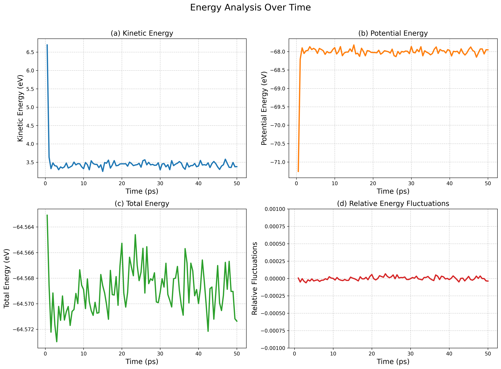
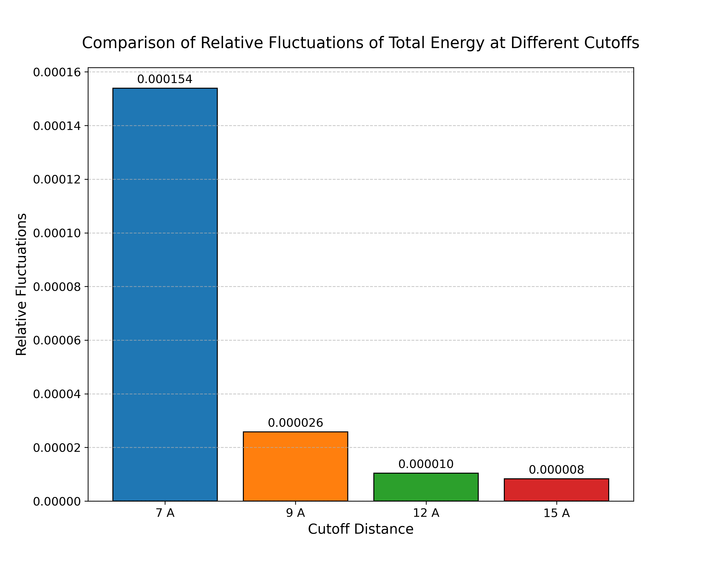
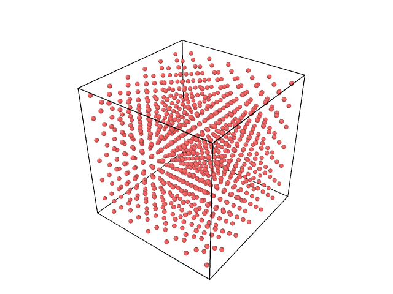
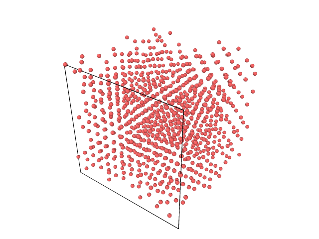
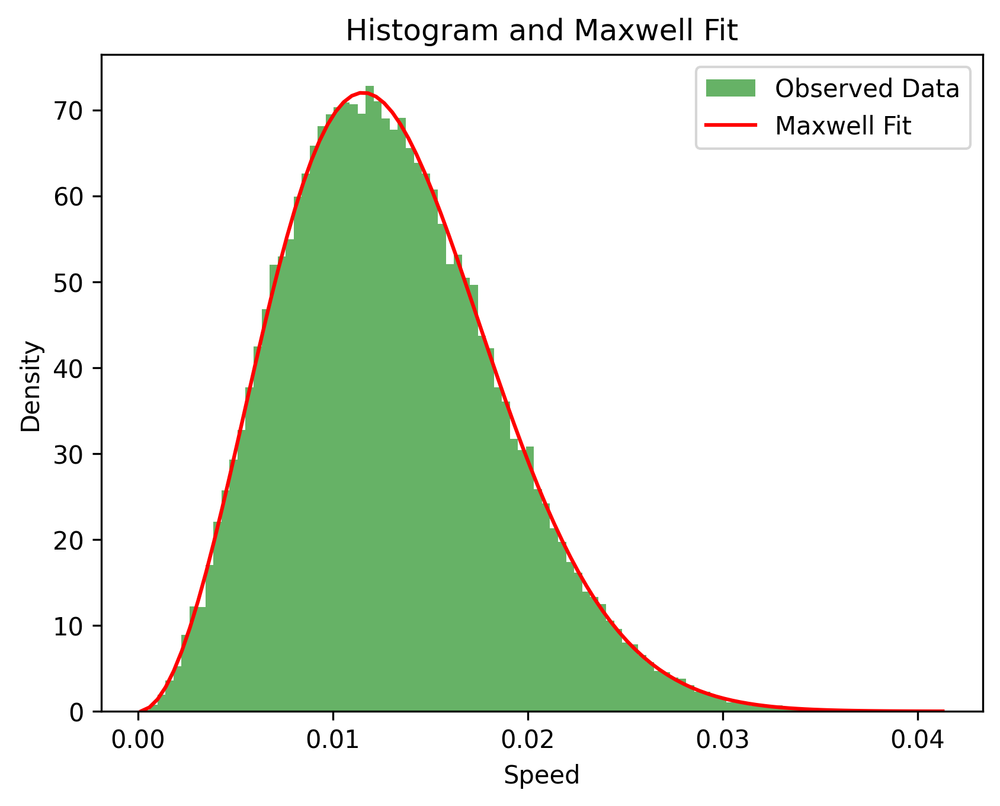
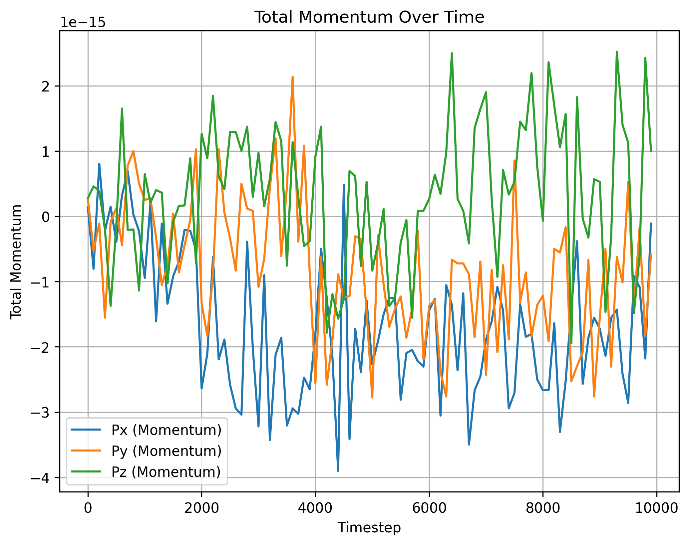
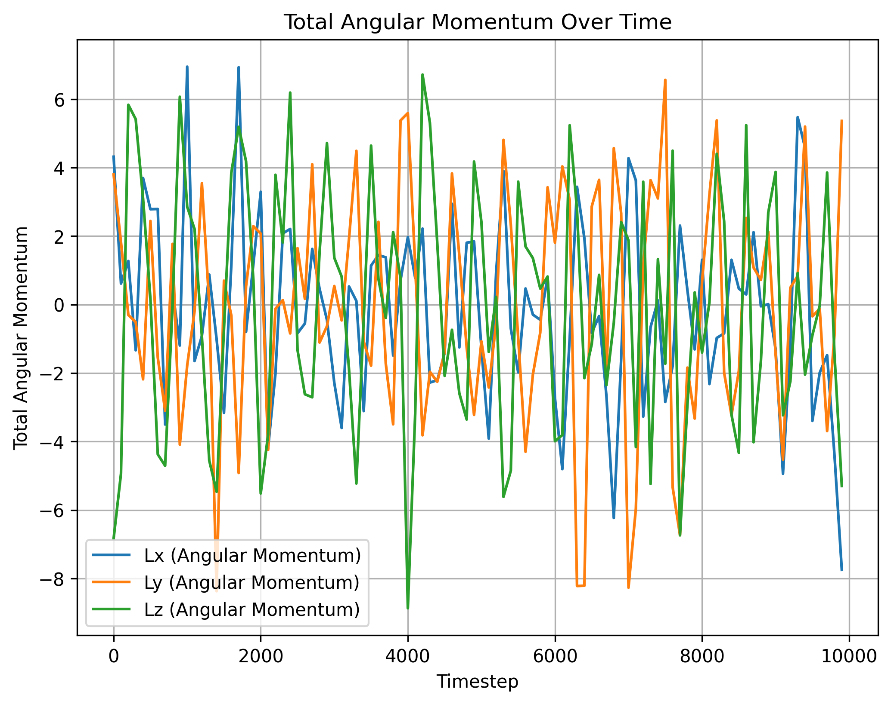
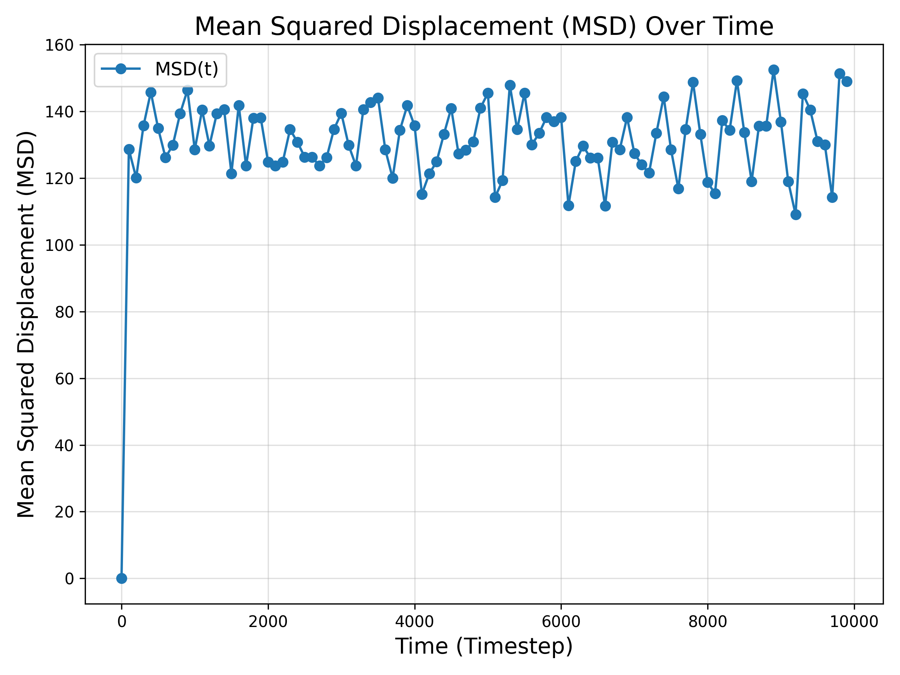
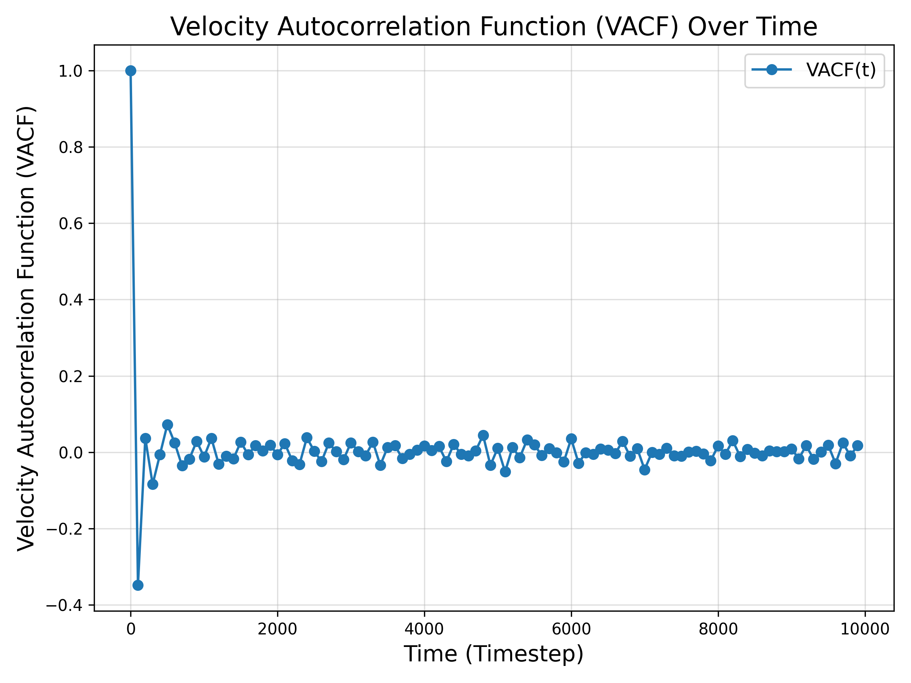

# [course 2024] Computational Physics

reference:

- [Molecular-Dynamics-Simulation: 樊哲勇](https://github.com/brucefan1983/Molecular-Dynamics-Simulation)
- [github.com: p-ranav/argparse](https://github.com/p-ranav/argparse)

## MDsim

<p align="center">  </p>

> input & init -> sim n steps -> post-processing

### build

```bash
cd MDsim
make
./bin/MDsim xyz.in run.in thermo.out traj.out

cd ./test/ArgonCrystal/
../../bin/MDsim xyz.in run.in therom.out traj.out
```

### TODO:

- [x] 实现近邻列表技术，加速计算
  - [`MDsim/scripts/CompareNeighborListMethod.ipynb`](MDsim/scripts/CompareNeighborListMethod.ipynb)
  - [x] 使用 c++ profiler 分析程序热点
  - [ ] 比较验证实现近邻列表前后加速效果
  - [ ] cpp vs python
- [x] 计算并输出 X (温度/压强/动能/势能)
  - 可视化 X-Time 图，分析 X 随时间的变化规律
  - [`energy_visualize.py`](MDsim/scripts/energy_visualize.py)
- [x] 输出 lammps 原子坐标文件
  - ovito 可视化
- [x] 输出轨迹: 即每一时刻各粒子的坐标和速度
  - 使用 ovito 可视化
  - 输出速度，验证速度是否以及何时满足麦克斯韦分布 满足
  - [`MDsim/scripts/Maxwell.ipynb`](MDsim/scripts/Maxwell.ipynb)
- [x] 验证体系动量守恒，角动量不守恒
  - [`MDsim/scripts/Momentum.ipynb`](MDsim/scripts/Momentum.ipynb)
- [x] 径向基函数 (RDF)
  - 表征粒子的空间分布并提供对系统结构的深入了解
  - [`MDsim/scripts/RDF.ipynb`](MDsim/scripts/RDF.ipynb)
- [x] Mean Squared Displacement (MSD) 均方位移
  - 测量粒子随时间移动的距离并帮助确定系统的扩散特性
  - [`MDsim/scripts/MSD.ipynb`](MDsim/scripts/MSD.ipynb)
- [x] Velocity Autocorrelation Function (VACF) 速度自相关函数
  - 确定粒子速度如何随时间相关
  - 了解扩散和弛豫时间等传输特性
  - [`MDsim/scripts/VAF.ipynb`](MDsim/scripts/VAF.ipynb)
- [x] 在某个样例上，分别使用 Lammps 和 我们的 MDsim 进行模拟，比较结果
  - Ar 晶格模拟 [`MDsim/test/lammps/compare.lmps`](MDsim/test/lammps/compare.lmps)
- [x] 探索使用 openmp 多线程库加速计算
  - [x] 对 find force 使用了 `openmp parallel for`
    - 当体系原子总数较少时，多线程并行加速不明显，甚至开销较大
- [ ] 探索使用 GPUMD 加速模拟
- [ ] update Makefile, to support `make debug` and `make *profile`

### 程序介绍

main 主控函数

1. 从文件中读取模拟参数（步数、时间步长、温度）
2. 从单独的 XYZ 文件中读取原子数据（位置、质量）
3. 根据温度初始化原子速度
4. 启动计时器测量模拟时间
5. 打开一个输出文件，用于写入模拟数据 (thermo.out)
6. 按指定步数运行主模拟循环：
   - 对所有原子应用周期性边界条件 (PBC)
   - 使用 Verlet 算法对位置和速度进行积分
   - 计算作用在每个原子上的力
   - 再次积分更新位置和速度
   - 每 Ns 步输出数据（温度、动能、势能）
7. 停止计时器并打印模拟耗时。

### 结果展示

#### 计算并输出 X (温度/压强/动能/势能)，可视化 X-Time 图，分析 X 随时间的变化规律

<p align="center">  </p>

<p align="center">  </p>

#### 输出 lammps 原子坐标文件/轨迹，并用 ovito 可视化

<p align="center">


</p>

#### 输出速度，验证速度是否以及何时满足麦克斯韦分布

<p align="center">  </p>

使用 ks test ([Kolmogorov-Smirnov test](https://en.wikipedia.org/wiki/Kolmogorov%E2%80%93Smirnov_test)) 检验

- KS Statistic: 0.002926712821151145
- P-value: 0.44900074468604223 > 0.05

不能拒绝原价设 H0，因此有 95% 的置信度认为速度满足麦克斯韦分布。

#### 检验体系动量/角动量是否守恒

<p align="center"> 
 
 
</p>

计算动量和角动量的最大变化值:

- momentum change max: 4.010680676458378e-15
  - Momentum is conserved. 误差范围内，动量守恒
- angular momentum change max: 12.591316347825899
  - Angular Momentum is not conserved. 误差范围内，角动量不守恒

#### Mean Squared Displacement (MSD) 均方位移

$$
\left.\operatorname{MSD} \equiv\langle | \mathbf{x}(t)-\left.\mathbf{x}_{0}\right|^{2}\right\rangle=\frac{1}{N} \sum_{i=1}^{N}\left|\mathbf{x}^{(\mathbf{i})}(t)-\mathbf{x}^{(\mathbf{i})}(0)\right|^{2}
$$

<p align="center">  </p>

#### Velocity Autocorrelation Function (VACF) 速度自相关函数

$$
C(j \Delta t)=\frac{1}{N-j} \sum_{i=0}^{N-1-j} v(i \Delta t) v((i+j) \Delta t)
$$

<p align="center">  </p>

#### 与 Lammps 模拟对比

Ar 晶格模拟 [`MDsim/test/lammps/compare.lmps`](MDsim/test/lammps/compare.lmps)

模拟参数如下:

```python
# run.in
atom_nums 864
velocity 60 # temperature in units of K
time_step 5 # time step in units of fs
run 10000
```

<p align="center">


</p>

图左为使用 MDsim 模拟计算所得结果，图右为使用 Lammps 在相同初始条件和模拟参数条件下的结果。

#### 近邻列表更新算法对比 $O(N)$ vs $O(N^2)$

```python
# run.in
atom_nums 864
velocity 60 # temperature in units of K
time_step 5 # time step in units of fs
run 10000
```

- ON1: Time used = 8.741 s
- ON2: Time used = 8.450 s

```python
# run.in
atom_nums 4000
velocity 60 # temperature in units of K
time_step 5 # time step in units of fs
run 1000
```

- ON1: Time used = 4.18134 s
- ON2: Time used = 5.63044 s
- None: Time used = 65.7296 s

#### 探索使用 openmp 多线程库加速计算

- 对 find force 使用了 `openmp parallel for`
- 当体系原子总数较少时，多线程并行加速不明显，甚至开销较大

```cpp
void MDSim::findForceParallel() {
  // ...
  double potentialEnergyLocal = 0.0;  // Thread-local potential energy

  size_t thread_count = 4;
#pragma omp parallel for num_threads(thread_count) \
    reduction(+ : potentialEnergyLocal) schedule(dynamic)
  for (int i = 0; i < numAtoms; ++i) {
    // ...
#pragma omp atomic
        fx[i] += f_ij * xij;
#pragma omp atomic
        fx[j] -= f_ij * xij;
    // ...
  }
}
```

```python
# run.in
atom_nums 4000
velocity 60 # temperature in units of K
time_step 5 # time step in units of fs
run 1000
```

parallel for find force:

- ON1: Time used = 12.7575 s, why?
- None: Time used = 24.7007 s or 21.1668 s

need profile to find the bottleneck!!

#### gprof 分析程序热点

```bash
Each sample counts as 0.01 seconds.
  %   cumulative   self              self     total
 time   seconds   seconds    calls  ms/call  ms/call  name
 59.86      2.43     2.43     1000     2.43     2.43  MDSim::findForce()
 26.36      3.50     1.07                             applyMic(double const*, double&, double&, double&)
 10.10      3.91     0.41       33    12.43    12.43  MDSim::findNeighborON1()
  2.46      4.01     0.10                             applyMicOne(double&)
  0.74      4.04     0.03     2000     0.02     0.02  MDSim::integrate(bool, double)
  0.25      4.05     0.01     1000     0.01     0.42  MDSim::findNeighbor()
  0.25      4.06     0.01       10     1.00     1.00  MDSim::dump_trj_one_step(std::ostream&, int) const
  0.00      4.06     0.00       33     0.00     0.00  MDSim::applyPbc()
```

## Lammps Scripts

#### Scripts for Lammps simulation.

- [`LammpsModeling/`](LammpsScripts/LammpsModeling/) Lammps 建模练习
- [`BrownMotion/`](LammpsScripts/BrownMotion/) 布朗运动
  - Class09, 布朗运动 计算扩散系数
  - 热浴 - 用于控温
  - Berendsen 热浴、Bussi-Donadio-Parrinello 热浴、
  - Nose-Hoover 热浴、Nose-Hoover 链热浴以及朗之万热浴
- [`Diffusion/`](LammpsScripts/Diffusion/) 扩散运动
  - Class09, 布朗运动 计算扩散系数
  - Ar 的扩散系数
- [`VacuumDiffusion/`](LammpsScripts/VacuumDiffusion) 真空扩散
- [`Flow/`](LammpsScripts/Flow) 流动 Class10
  - 流速随距离 x 的变化
- [`Vicosity/`](LammpsScripts/Vicosity) 粘度 Class10
- [`BalanceLatticeConstant/`](LammpsScripts/BalanceLatticeConstant) 平衡晶格常数
  - Class11, 力学性质计算
  - 循环控制 二次曲线拟合
- [`LJ-BodyModulus/`](LammpsScripts/LJ-BodyModulus) LJ 体模量
  - Class11, 力学性质计算
  - BM (Birch-Murnaghan) 方程拟合
- [`ThermalExpansion/`](LammpsScripts/ThermalExpansion) 热膨胀
  - Class12, 热力学性质计算
- [`MeltingPoint/`](LammpsScripts/MeltingPoint) 熔点
  - Class12
- [`HeatConduction/`](LammpsScripts/HeatConduction) 热传导
  - Class13, 热输运性质计算
  - 傅里叶定律; 非平衡法计算热导率; Green-Kubo 理论

others

- [`potentials/`](LammpsScripts/) 相互作用势
